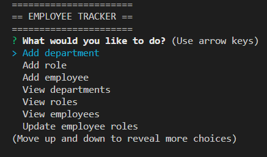

# EMPLOYEE TRACKER

## DESCRIPTION
This app was created as part of the UW Coding Bootcamp. It's an employee tracker that allows the user to view, add entries, and update entries in a database.

## USAGE
- Use the arrow keys and press the enter button to make selections.
- Add department: to add a new department, select the add department option, enter the name of the department. Your department is now added to the database!
- Add role: to add a new role, select the add role option, enter the name of the role, enter the department the role belongs to. Your role is now added to the database!
- Add employee: Select add employee from the menu. Enter the employee's first name, last name, role, and their manager (optional). Your employee is now added to the database!
- View departments: select the view departments options to see a table of all departments.
- View roles: select the view roles option to see a table of all roles.
- View employees: select the view employees option to see a table of all the employees.
- Update employee roles: select the update employee roles option to update a particular employee's role. Select the employee's name you wish to update then select the role you wish to be updated. Your employee's role has now been updated in the database!

## VIDEO WALKTHROUGH LINK
https://drive.google.com/file/d/12ZwIGO1D0UIeaCR124CMAi9FrTHZ2Lnu/view

## SCREENSHOT
